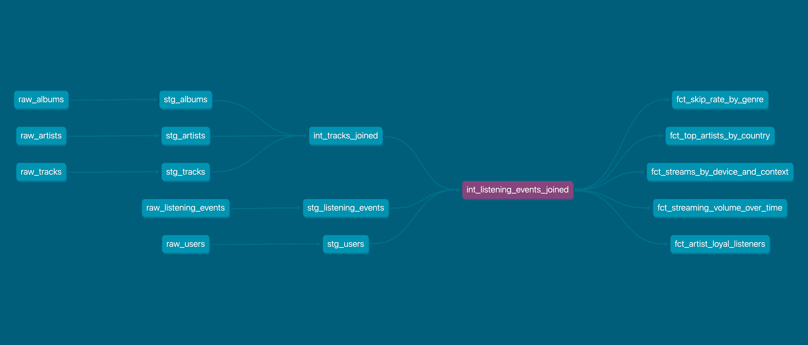

# Spotify Streaming Analytics — dbt + DuckDB

## Overview
This project is an analytics engineering portfolio project built with dbt and DuckDB. It models 5 raw data sources into a 3-layer warehouse architecture, answering 5 business questions around music streaming behaviour including top artists by country and streaming volume over time.

## Business Questions
- What is the stream-to-skip ratio by genre and subscription tier?
- Who are the top 10 artists by total streaming minutes, and how does their popularity vary by country?
- How do total streams vary across device types and listening contexts?
- Which artists have the most loyal listeners — defined as users who have streamed the same artist more than 5 times?
- How does streaming volume trend over time, broken down by genre? 


## Tech Stack
- dbt
- DuckDB

## Project Structure

- **Staging** — Cleaned and standardised 5 raw source tables, applying consistent type casting, whitespace trimming, and casing conventions across string, numeric, boolean, and timestamp columns.
- **Intermediate** — Built 2 intermediate models to resolve foreign keys and consolidate source data. Tracks, albums, and artists were joined into a single enriched track model, which was then combined with listening events and user data to produce one wide table serving as the foundation for all mart models.
- **Marts** — Built 5 aggregated fact tables, each answering a specific business question. All marts reference the single intermediate wide table, avoiding repeated join logic and ensuring a consistent single source of truth across all analytical outputs.

## DAG


## Data Model
The project uses 5 synthetic datasets representing a music streaming platform:

- **raw_artists** — 250 artists with genre and country of origin
- **raw_albums** — 600 albums linked to artists
- **raw_tracks** — 3,500 tracks linked to albums and artists
- **raw_users** — 800 users with subscription tier, country, and acquisition channel
- **raw_listening_events** — 150,000 streaming events representing individual track plays

## How to Run

1. Clone the repo
```bash
git clone git@github.com:amanpatel6/spotify-streaming-analytics.git
cd spotify-streaming-analytics
```

2. Create and activate a virtual environment
```bash
python -m venv .venv
source .venv/bin/activate
```

3. Install dbt and dependencies
```bash
pip install dbt-duckdb
dbt deps
```

4. Load seed data, run models and tests
```bash
dbt seed
dbt run
dbt test
```

## Tests
The project includes 67 tests across all layers:

- **Generic tests** — `not_null`, `unique`, `accepted_values`, and `relationships` applied across staging models
- **dbt_utils tests** — `accepted_range` to validate numeric boundaries and `unique_combination_of_columns` to assert correct grain on mart models
- **Referential integrity** — `relationships` tests on all foreign keys across staging models